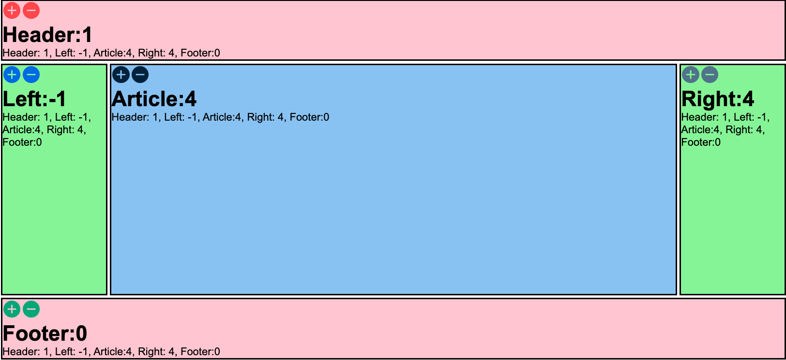

# Holy-Grail-Application

This repository contains full stack holy grail application. The front end of the application will have a header, a footer, a main article, and panes on the right and left. The front end of the application use react framework and back end is running on the Node.js platform with an additional package of Express for defining the routes and the API. Superagent is used to make calls to the backend. Redis is set up as a database and run it on top of a Docker.

## [DEMO](https://youtu.be/7hDUZLj2nyI)

## How to use

1. Download or clone the repository.
2. Run npm install in the terminal.
3. Run Docker in terminal, docker run -p 6379:6379 --name some-redis -d redis
4. Run node index.js.

## Technologies 
1. HTML
2. CSS
3. React JS
4. Node JS
5. Docker
6. Redis database

## Screenshot

## LICENSE

MIT License

Copyright (c) 2023 Nandhini K

Permission is hereby granted, free of charge, to any person obtaining a copy
of this software and associated documentation files (the "Software"), to deal
in the Software without restriction, including without limitation the rights
to use, copy, modify, merge, publish, distribute, sublicense, and/or sell
copies of the Software, and to permit persons to whom the Software is
furnished to do so, subject to the following conditions:

The above copyright notice and this permission notice shall be included in all
copies or substantial portions of the Software.

THE SOFTWARE IS PROVIDED "AS IS", WITHOUT WARRANTY OF ANY KIND, EXPRESS OR
IMPLIED, INCLUDING BUT NOT LIMITED TO THE WARRANTIES OF MERCHANTABILITY,
FITNESS FOR A PARTICULAR PURPOSE AND NONINFRINGEMENT. IN NO EVENT SHALL THE
AUTHORS OR COPYRIGHT HOLDERS BE LIABLE FOR ANY CLAIM, DAMAGES OR OTHER
LIABILITY, WHETHER IN AN ACTION OF CONTRACT, TORT OR OTHERWISE, ARISING FROM,
OUT OF OR IN CONNECTION WITH THE SOFTWARE OR THE USE OR OTHER DEALINGS IN THE
SOFTWARE.
